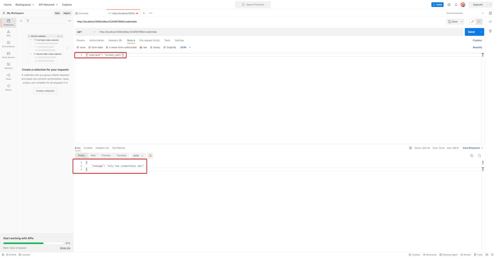
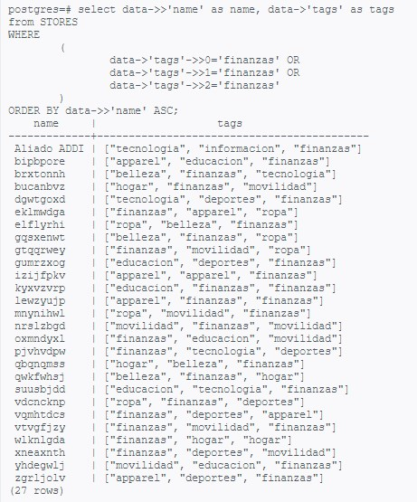

# SE-technical-challenge
This is a Flask (python) application that runs alongside a postgreSQL database with random data in a docker container.
From this source code you can build the docker image.
## Solution of this Technical challenge:
Our sales team has asked our support engineering team to configure a pre-established process to integrate a new ally into our platform. This process requires adding new records to a SQL database and using an endpoint of our API.

The process consists of:

1. Manually inserting  information to the table ```stores``` using an SQL script
2. An SQL query to find all allies that have the tag ```finanzas```
3. An HTTP request to add the ally's credentials through our API.

## Execution of the process

The usage of this tool consists in 2 parts:
- Configuration of the environment
- Making POST or GET requests to the API

## How to run this app in local environment?
To run this application in a local environment, the following requirements must be met:

- Use a Linux environment (Distributions like Ubuntu or Manjaro are the most popular)
- Have docker installed
- Have Git installed
- Have Postman installed   

Then the following steps must be performed:

1. Clone this repository to a local folder.

```bash
git clone https://github.com/yangwarr/SE-technical-challenge.git
```
2. Build the docker image (With a terminal in the directory that contains the dockerfile):
```bash
sudo docker build -t addi-assesment .  
```
3. Run the bash file ```run.sh```:
```bash
bash run.sh  
```
4. Open the docker container's bash:  
```bash
sudo docker exec -it addi-app /bin/bash  
```
* Alternatively you can use the file with friendly name:  
```bash
bash enter_docker_bash.sh  
```
5. Once inside the docker cli, you will be in a folder that contains the necessary script to start, the "run_flask.sh" application:  
```bash
bash run_flask.sh  
```

This starts the application and the database, which are listening on port 5000 and 5432 respectively. At this point the terminal can be closed and the application will continue to run.

To stop the application this commands can be used from a different terminal: 
```bash
sudo docker stop addi-app
sudo docker system prune
```
### How to connect to the database
The credentials for the locally deployed database are:
```
- host: localhost:5432
- database: postgres
- password: 1234
```

## API endpoint specification:
The API, when started with the run_flash.sh command, does the following:
- Start the application.
- Populate the database with random data.
- Starts listening to requests at address 127.0.0.1:5000
- You can use the template insertNewAlly.sql to insert a new ally without credentials and later on add its credentials through POSTMAN.


### Doing POST and GET requests:

- Make sure you have The Postman app (https://www.postman.com/downloads/)
- Make sure you create a Workspace  https://web.postman.co/
- After creating the Workspace, click new and create a new HTTP Request
- Select on the dropdown list either GET or POST and insert the link e.g. http://localhost:5000/allies/1234567890/credentials (replace "1234567890" with the actual ID from the database, this ID is an example ally from the template insertNewAlly.sql)
- In this example we'll first create a POST request to add the credentials.
- Navigate to Body -> Raw and insert the following JSON {"username": "aliado_addi", "password": "}sxh7_5}BdJ4K:Qf"} and hit send.
- You should see a success message.

- Now we can do a GET request for the same ally, passing just the username. E.g. {"username": "aliado_addi"}


### Finding all allies that have the tag ```finanzas```

- Open docker and in the terminal type, ```psql -h localhost -U postgres``` to initialize the database
- Upon initializing the database you can run that is inside the file selectFinanzasAlly.sql, two alternatives are present based on your needs.
- Insert the query into the docker terminal and press enter, results will be shown.


### Endpoint: credentials
```
POST /allies/{allyId}/credentials
Add communication credentials to an ally

Headers: "Content-Type: application/json"

Parameters:
allyId(path): string identification for an ally.

Payload(body): json object, example
{
	"username": "addi",
	"password": "123456"
}

Responses:
200: 
{
	"message": "Credentials added",
	"allyId": "allyId",
	"allyName": "ally name"
}
400:
{
	"message": "The ally was not found or the request is not correct"
}
500:
{
	"message": "Server error"
}
```

```
GET /allies/{allyId}/credentials

Checks if the given ally has active credentials and is an allowed origin in our application

Headers: "Content-Type: application/json"

Parameters:
allyId(path): string identification for an ally.

Responses:
200: 
{
	"message": "Ally has credentials set!"
}
400:
{
	"message": "Ally does not have credentials set!"
}
404:
{
	"message": "Ally was not found"
}
500:
{
	"message": "Server error"
}
```
